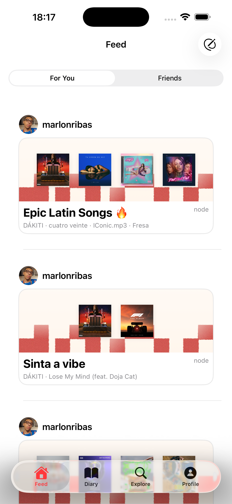
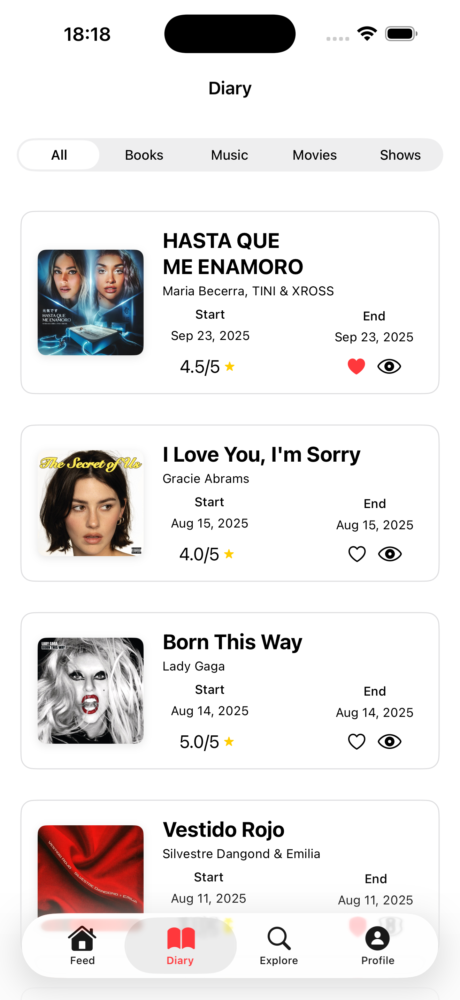
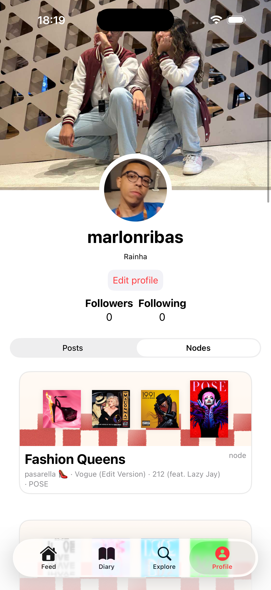

# Node

---

## 📚 Sobre o Projeto

O **Node** é um aplicativo que permite conectar diferentes tipos de mídia — como músicas, filmes, séries e livros — criando relações entre conteúdos e experiências.

Desenvolvido durante o quarto challenge do **Apple Developer Academy**, este foi meu terceiro projeto dentro do programa.

---

## 🖼️ Preview do App

  
  
  

---

## ✨ Features

### 🔗 Nodes
- Conecte diferentes mídias em um único espaço  
- Adicione título e descrição  
- Compartilhe dentro do app ou em redes externas  

### 📔 Diary
- Registre mídias favoritas  
- Marque como *relog*  
- Defina datas de consumo  
- Avalie com até ⭐⭐⭐⭐⭐  
- Escreva reviews e publique  

### 📝 Posts
- Crie textos longos  
- Relacione até 10 mídias em um único post  
- Adicione título e imagem de capa  

---

## 🛠️ Tecnologias Utilizadas

- 🔴 **Swift**
- 🔴 **SwiftUI + UIKit**
- 🔴 **APIs**
- 🔴 **CloudKit**
- 🔴 **CreateML**

---

## 👥 Equipe

Este projeto foi desenvolvido em colaboração com:

- Agnes Manoel  
- Gabriel Lima  
- Maria Cecília  
- Vinícius Garcia  

---

## 🔗 Repositório

